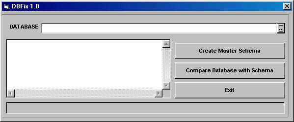



## DB Compare & Fix

### Description

This small program is very usefull when you want to compare destination mdb file from your development mdb. It is not only compare the database (tables, indexes and queries) schema but also Fix It !, this prog use temporary mdb to hold the schema so you just bring this prog and schema file and compare it at your customer. if you like it please give me a credit!
 
### More Info
 

             |
---                |---
**Submitted On**   |2002-12-12 16:40:38
**By**             |[Januar Kwee](https://github.com/Planet-Source-Code/PSCIndex/blob/master/ByAuthor/januar-kwee.md)
**Level**          |Intermediate
**User Rating**    |4.8 (19 globes from 4 users)
**Compatibility**  |VB 6\.0
**Category**       |[Databases/ Data Access/ DAO/ ADO](https://github.com/Planet-Source-Code/PSCIndex/blob/master/ByCategory/databases-data-access-dao-ado__1-6.md)
**World**          |[Visual Basic](https://github.com/Planet-Source-Code/PSCIndex/blob/master/ByWorld/visual-basic.md)
**Archive File**   |[DB\_Compare15123112132002\.zip](https://github.com/Planet-Source-Code/januar-kwee-db-compare-fix__1-41545/archive/master.zip)

